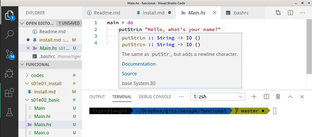

```sh
## Instalar prerequisitos para ubuntu
sudo apt install libicu-dev libncurses-dev libgmp-dev git build-essential libicu-dev libtinfo-dev libgmp-dev libc6-dev libffi-dev git g++ gcc make xz-utils zlib1g-dev gnupg curl

# rode os comando com um usuário não root
bash <(curl https://nixos.org/nix/install)

# rode o comando abaixo
# abra o arquivo ~/.profile e adicione essa linha ao final
. ~/.nix-profile/etc/profile.d/nix.sh

# deslogue e logue novamente

# instale o cachix
nix-env -iA cachix -f https://cachix.org/api/v1/install
cachix use all-hies

# install ghc versao 865
nix-env -iA unstableFallback.selection --arg selector 'p: { inherit (p) ghc865; }' -f https://github.com/infinisil/all-hies/tarball/master

# instalar ghc e stack e cabal no arquivo ~/.ghcup
curl https://get-ghcup.haskell.org -sSf | sh

# adicione a seguinte linha no seu .bashrc ou .zshrc
source '/home/tiger/.ghcup/env'


# Digite yes quando terminar o comando

# desloque e logue de novo ou abra um novo terminal
# teste digitando ghc ou ghci
```

Instalar vscode e a extensão `haskell language server`

Criar um código simples em haskell e testar se o funciona o autocomplete e a identificação de erros.

```hs
-- Main.hs
main = do
    putStrLn "Hello, what's your name?"  
    name <- getLine
    putStrLn ("Hey " ++ name ++ ", you rock!")
```

Compilar e executar usando

```bash
ghc -o Main Main.hs
./Main
```

Se o plugin estiver instalado corretamente, deve ficar parecido com essa tela:




## Bibliotecas úteis

Instale utilizando o gerenciador de pacotes
```
cabal install split --lib
```

```hs
import Data.List.Split
splitOn "," "my,comma,separated,list"
```

